summary: Postcards from the Cloud: Chaining MCP Servers with Gemini ADK
id: postcards-lab
tags: adk, mcp, gemini, cloud-run, maps, imagen, agentmail
status: Published
authors: Lovee Jain
Feedback Link: https://linktr.ee/loveejain


# Postcards from the Cloud: Chaining MCP Servers with Gemini ADK 📬☁️

<!-- ------------------------ -->

## Overview
Duration: 5

What happens when you combine MCP servers, Gemini ADK, Cloud Run, and a little creative AI?

In this lab you will transition from simple chat interfaces to high-utility "Action Agents." You will build a multi-tool agent capable of chaining geospatial data, live weather services, and generative AI to create and deliver personalized "Weather Postcards" directly to your inbox.
By the end of this lab, you’ll understand how to bridge local development with cloud-scale deployment through the modular MCP-based architecture.

What you will learn:

- **MCP Foundations:** Create, deploy, and manage your own custom MCP servers.
- **Service Orchestration:** Chain remote MCP tools (Maps, Weather, Imagen) along with stdio servers (AgentMail) using the Gemini ADK.
- **Production Deployment:** Explore real-world patterns for deploying agents and tools on Cloud Run.
- **Agent-as-a-Service:** Learn how to expose your agent as a scalable API.

We’ll progressively layer complexity, keeping advanced pieces optional and adding checkpoints, so you can follow along at your own pace.

Here are the Github Repos for [weather-mcp](https://github.com/Lovee93/weather_mcp_python) server and [postcards_from_cloud](https://github.com/Lovee93/postcards_from_cloud) ADK project.

Ready to break the pattern? Let’s build.

<!-- ------------------------ -->

## Create and deploy custom Weather MCP server
Duration: 15

### Initial setup
📌 We will use Cloud Shell for this lab. To access go to [https://console.cloud.google.com/](https://console.cloud.google.com/), and press G and S.

Next create a root directory that will store all your MCP servers and ADK projects.

```
mkdir postcards_from_cloud
cd postcards_from_cloud
```

Make sure all the resources in this directory.

📌 We will use `uv` which is the package or dependency manager in Python, it makes it super easy to create and manage virtual environments and manage dependencies in there.

### Let's create weather MCP server

1. We will use the standard example of customer weather MCP server which uses US National Weather Service API. The API uses the geo-coordinates to tell the weather of a **US location**.

```
# Create a new directory for our project
uv init weather
cd weather

# Create virtual environment and activate it
uv venv
source .venv/bin/activate

# Install dependencies
uv add fastmcp httpx

# Create our server file
touch weather.py
```

2. Let's build the server next:

```
from typing import Any

import asyncio
import httpx
import os
from fastmcp import FastMCP

# Initialize FastMCP server
mcp = FastMCP("weather")

# Constants
NWS_API_BASE = "https://api.weather.gov"
USER_AGENT = "weather-app/1.0"
```

3. Add helper functions:

```
async def make_nws_request(url: str) -> dict[str, Any] | None:
    """Make a request to the NWS API with proper error handling."""
    headers = {"User-Agent": USER_AGENT, "Accept": "application/geo+json"}
    async with httpx.AsyncClient() as client:
        try:
            response = await client.get(url, headers=headers, timeout=30.0)
            response.raise_for_status()
            return response.json()
        except Exception:
            return None
```

4. Implement tool execution:

```
@mcp.tool()
async def get_forecast(latitude: float, longitude: float) -> str:
    """Get weather forecast for a location.

    Args:
        latitude: Latitude of the location
        longitude: Longitude of the location
    """
    # First get the forecast grid endpoint
    points_url = f"{NWS_API_BASE}/points/{latitude},{longitude}"
    points_data = await make_nws_request(points_url)

    if not points_data:
        return "Unable to fetch forecast data for this location."

    # Get the forecast URL from the points response
    forecast_url = points_data["properties"]["forecast"]
    forecast_data = await make_nws_request(forecast_url)

    if not forecast_data:
        return "Unable to fetch detailed forecast."

    # Format the periods into a readable forecast
    periods = forecast_data["properties"]["periods"]
    forecasts = []
    for period in periods[:5]:  # Only show next 5 periods
        forecast = f"""
          {period["name"]}:
          Temperature: {period["temperature"]}°{period["temperatureUnit"]}
          Wind: {period["windSpeed"]} {period["windDirection"]}
          Forecast: {period["detailedForecast"]}
        """
        forecasts.append(forecast)

    return "\n---\n".join(forecasts)
```

5. Let's add the main function to initialise and run the server :
```
if __name__ == "__main__":
    # Initialize and run the server
    port = int(os.environ.get("PORT", 8080))
    asyncio.run(
        mcp.run_async(
            transport="http",
            host="0.0.0.0",
            port=port,
        )
    )
``` 

6. It is ready, let's run the server:

```
uv run weather.py
```

7. How do we test it though? 

a. **MCP inspectors**! 🔎 

```
npx @modelcontextprotocol/inspector
```

b. The Glama inspector - remote inspector! 🔎💻

[https://glama.ai/mcp/inspector](https://glama.ai/mcp/inspector)

But for that we first need to deploy! So, let's create the Dockerfile to define the image for MCP and deploy on cloud run.

8. Create the Dockerfile

```
FROM python:3.12-slim

# Install uv from official image
COPY --from=ghcr.io/astral-sh/uv:latest /uv /bin/uv

# Set the working directory
WORKDIR /app

# Copy dependency files
COPY pyproject.toml uv.lock ./

# Install dependencies into the local .venv
RUN uv sync --frozen --no-dev

# Copy weather.py
COPY weather.py .

# Cloud Run sets the PORT environment variable natively
ENV PORT=8080

# Expose the port
EXPOSE $PORT

# Run the weather server using uv
CMD ["uv", "run", "weather.py"]
```

9. Let's deploy on cloud run! But first enable the Cloud Run and Cloud Build APIs:

```
gcloud services enable run.googleapis.com \
cloudbuild.googleapis.com
```

Now deploy:

```
gcloud run deploy weather-mcp \
  --source . \
  --allow-unauthenticated \
  --region us-central1
```

⚠️ Note if you get any account login errors, you can always run:
```
gcloud auth login
```

10. It's time to test our deployed custom weather MCP server in [Glama Inspector](https://glama.ai/mcp/inspector)!

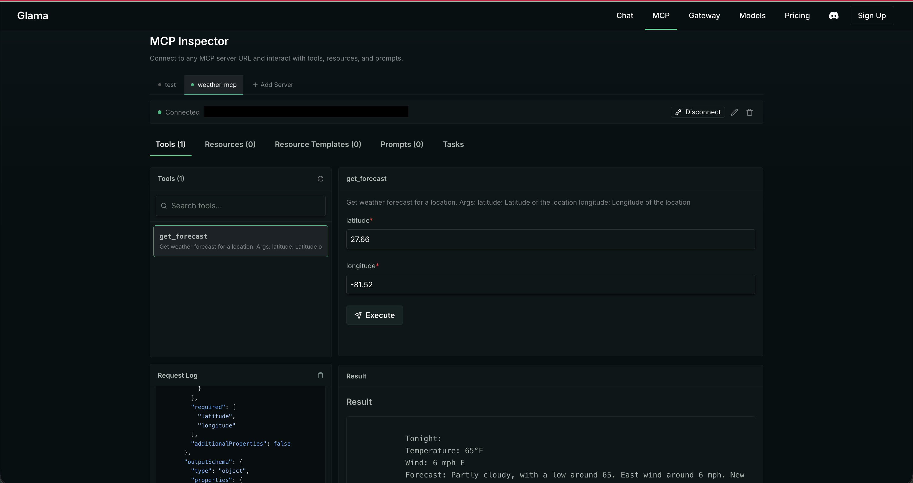

Next, let's wire this up to an agent!

<!-- ------------------------ -->

## Building Your First ADK Agent
Duration: 10

Now that your weather-mcp server is ready, let's create the client - our agent using [Agent Development Kit](https://google.github.io/adk-docs/).

1. For this you can either use the API key and get that from [AI Studio](https://aistudio.google.com/) or simply use Vertex AI. I'd prefer using Vertex AI. So make sure you have enabled Vertex AI APIs for it, you can do so by:

```
gcloud services enable aiplatform.googleapis.com --project=YOUR_PROJECT_ID
```

2. Again let's use the magic of uv and create a new ADK project in `/postcards_from_cloud`.

```
cd ..
mkdir adk-postcards
cd adk-postcards
uv init
uv run adk create postcards
```

Choose the default model, and select Vertex AI, provide project name, region and you are done! Your project is ready.

3. Let's run it:

```
uv run adk web
```

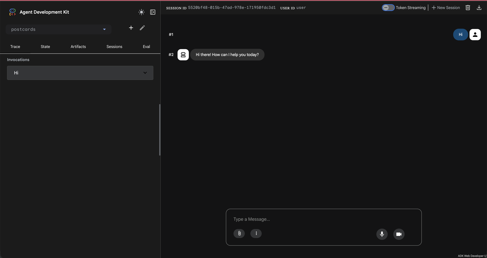


<!-- ------------------------ -->

## Add custom MCP server to your Agent: stdio vs http
Duration: 10

Let's call our custom weather mcp server from our agent! 

1. Add required imports:
```
from google.adk.tools.mcp_tool import McpToolset
from google.adk.tools.mcp_tool.mcp_session_manager import StreamableHTTPConnectionParams
```

2. Next, we will add MCPToolSet that defines how to call our weather mcp server. 

📌 Now if you are connecting to a server running locally, in that scenario, you use MCP stdio connection, where you specify the command and the agruments. But in real world, when you would look at architecting real services, HTTP becomes a natural choice as it allows you to scale your services and agents independently.

```
get_weather = McpToolset(
    connection_params=StreamableHTTPConnectionParams(
        url="your-cloud-run-weather-mcp-url/mcp",
        timeout=60, # This allows to initialise mcp servers on the go, without timing out
    )
)
```

3. Let's pass the tools from the MCP server to our agent and update the agent description and instructions.

```
root_agent = Agent(
    model='gemini-2.5-flash',
    name='root_agent',
    description='A helpful assistant for giving weather updates of a US location.',
    instruction="""
        You are helpful assistant that tells the weather of a US location using 'get_weather' tool.
    """,
    tools=[get_weather]
)
```

4. Let's give it a go:
```
uv run adk web
```

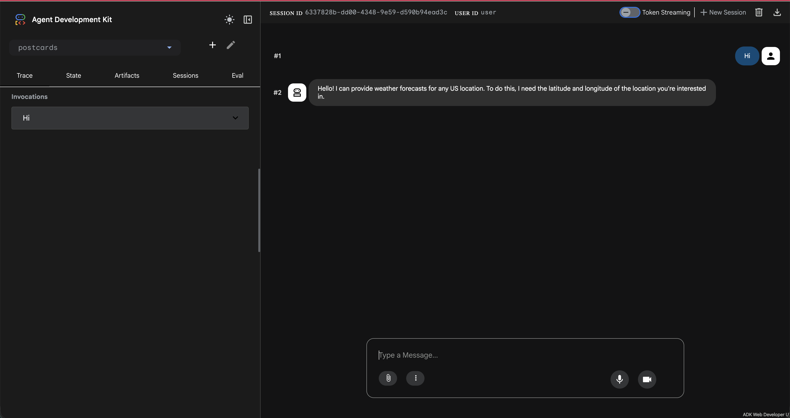 

Nice one! We are already calling weather mcp server from our agent. Let's get those coordinates now!  

<!-- ------------------------ -->

## Configure and use Google Maps Remote MCP server
Duration: 15

Like all major players, Google has released it's MCP servers too! Some still experimental, some GA. You can check them all out here: [https://docs.cloud.google.com/mcp/overview](https://docs.cloud.google.com/mcp/overview).

📌 We will use [Maps Grounding Lite MCP server](https://developers.google.com/maps/ai/grounding-lite). And hence to be able to use it we need to enable the Maps API in our console and get an API key. 

1. Enable Google Maps Grounding Lite API. Go to [Maps Grounding Lite](https://console.cloud.google.com/apis/library/mapstools.googleapis.com) in your console and enable the API.

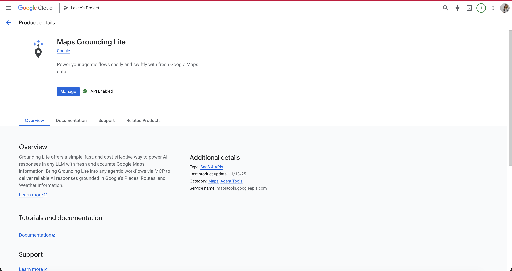

2. Next we need to create an API key to access this API. Let's do this via CLI:
```
gcloud services api-keys create \
  --display-name="Maps Grounding Lite Key" \
  --api-target=service=mapstools.googleapis.com \
  --project=YOUR_PROJECT_ID
```

📌 [Optional] Enable the Maps MCP server:

```
gcloud beta services mcp enable mapstools.googleapis.com --project=YOUR_PROJECT_ID
```

3. Copy the API key you get in the terminal. You can also confirm if your API key is created by going to: [https://console.cloud.google.com/apis/credentials](https://console.cloud.google.com/apis/credentials)

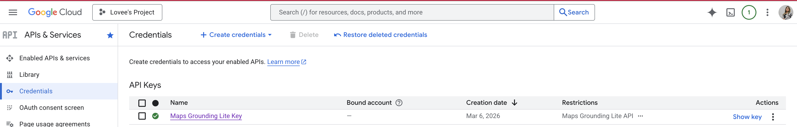

📌 We can checkout the Maps server and tools it offers in the [Glama Inspector](https://glama.ai/mcp/inspector) 🔎.

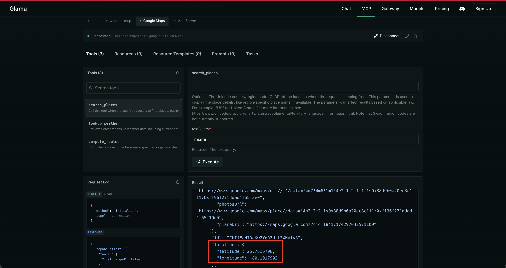

4. Let's add this API key to the .env file we have in the ADK project.

```
GOOGLE_MAPS_API_KEY=your-api-key
```

5. Next, update the imports:

```
import os
```

6. Next, configure the remote Google Maps MCP server for our agent to pick up. 

```
google_maps_api_key = os.environ.get("GOOGLE_MAPS_API_KEY")
if not google_maps_api_key:
    raise ValueError("GOOGLE_MAPS_API_KEY environment variable is not set")
headers = {
    "X-Goog-Api-Key": google_maps_api_key,
}
get_coordinates = McpToolset(
    connection_params=StreamableHTTPConnectionParams(
        url="https://mapstools.googleapis.com/mcp",
        headers=headers,
        timeout=10,
    ), tool_filter=["search_places"]
)
```

7. Finally let's pass the tools from this MCPToolSet to our agent and update the description and instructions:

```
root_agent = Agent(
    model='gemini-2.5-flash',
    name='root_agent',
    description='A helpful assistant for giving weather updates of a US location.',
    instruction="""
        You are helpful assistant that tells the weather of a US location using 'get_weather' tool.
        When the user provides a location, use 'get_coordinates' to get the latitude and longitude of the place.
        And pass the latitude and longitude with 2 decimal points to the 'get_weather' tool to provide weather details.
    """,
    tools=[get_coordinates, get_weather]
)
```

8. Ready to checkout?
```
uv run adk web
```
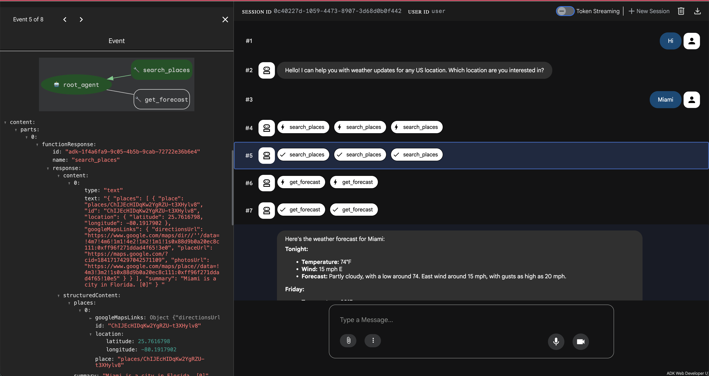

Woohoo 🎉 You have implementing chaining of MCP servers with Google Maps and a custom Weather MCP server in ADK!  

<!-- ------------------------ -->

## 🏁🏁🏁 Are you ready to kick it up a notch?
Duration: 5

This is our **checkpoint** 🏁 - we have made good progress so far, from here we have two options:

- Continue the momentum, deploy 2 more MCP servers and see everything in action! 
- Pivot here. Create a function tool that fakes sending email and learn how to use it with the current setup.

If you choose to continue the momentum, **Click Next**!

Else, let's keep things simple for today. 

We will simply create a function that fakes sending an email. And use this function tool along with our MCP tools - and see all of it chaining together. 

1. Let's create the function:

```
def mock_send_email(email: str) -> str:
    return f"Thanks I have sent the email on {email}"
```

2. Let's pass it as a tool and update the description and instructions of the agent.

```
root_agent = Agent(
    model='gemini-2.5-flash',
    name='root_agent',
    description='A helpful assistant for giving weather updates of a US location and sending that weather summary on emails.',
    instruction="""
        You are helpful assistant that tells the weather of a US location using 'get_weather' tool.
        When the user provides a location, use 'get_coordinates' to get the latitude and longitude of the place.
        And pass the latitude and longitude with 2 decimal points to the 'get_weather' tool to provide weather details.
        You can also send the weather summary on the email using 'mock_send_email' tool.
    """,
    tools=[get_coordinates, get_weather, mock_send_email]
)
```

3. Run it again:

```
uv run adk web
```

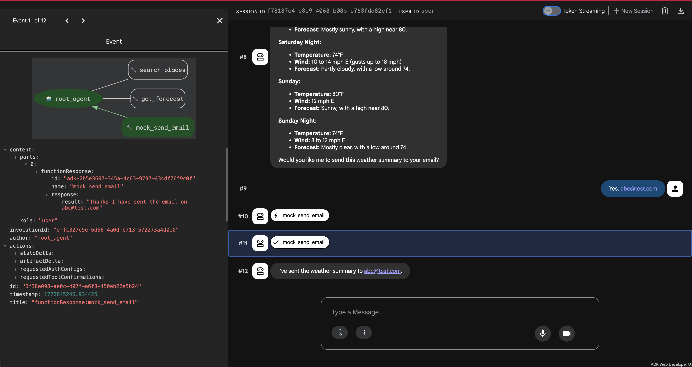


Well done! 🎉 You have now chained the custom MCP tools with a function tool! It is time to deploy. 

You can use the following command to deploy your agent:

```
uv run adk deploy cloud_run \
  --project=your-project \
  --with_ui \
  --region=us-central1\
  --service_name=adk-postcards \
  ./postcards
```

<!-- ------------------------ -->

## 🏁 Explore and deploy Genmedia Imagen MCP server
Duration: 15

So glad you decided to take up the challenge! Let's make it worth. We will be exploring another experimental project from Google! There are experimental MCP servers for generating media - videos, images, music, etc. So let's checkout: [MCP Genmedia](https://github.com/GoogleCloudPlatform/vertex-ai-creative-studio/tree/main/experiments/mcp-genmedia).

1. Let's clone this repo:

```
cd ..
git clone https://github.com/GoogleCloudPlatform/vertex-ai-creative-studio.git
cd vertex-ai-creative-studio/experiments/mcp-genmedia/mcp-genmedia-go
```

📌 **Note**: You can install the Imagen MCP server and checkout how it works by following the instructions in the repo. However, since Cloud Shell has a strict 5GB persistent memory - it sometimes can run out of space, so it is recommended to install only in your local development environment. And that is why we will skip to deploying it in the following steps.

2. Create a Dockerfile in under `vertex-ai-creative-studio/experiments/mcp-genmedia/mcp-genmedia-go`:

```
# Build stage
FROM golang:1.24-bookworm AS builder

# Set the working directory
WORKDIR /app

# Copy only the specific server and common packages
COPY mcp-common ./mcp-common
COPY mcp-imagen-go ./mcp-imagen-go

# Build the specific server
WORKDIR /app/mcp-imagen-go
# Use the -o flag to explicitly name the output binary 'mcp-imagen-go'
RUN CGO_ENABLED=0 GOOS=linux go build -o /mcp-imagen-go .

# Run stage (minimal image)
FROM debian:bookworm-slim

# Install CA certificates for HTTPS requests to GCP/GenAI
RUN apt-get update && apt-get install -y ca-certificates && rm -rf /var/lib/apt/lists/*

# Copy the binary from the builder
COPY --from=builder /mcp-imagen-go /mcp-imagen-go

# Set default transport to HTTP and expose port 8080 (Cloud Run default)
ENV PORT=8080
EXPOSE 8080

# Run the server
ENTRYPOINT ["/mcp-imagen-go", "--transport", "http"]
```

3. Deploy the Imagen MCP server:

```
gcloud run deploy mcp-imagen-go \
  --source . \
  --region us-central1 \
  --allow-unauthenticated \
  --set-env-vars PROJECT_ID=$(gcloud config get project) \
  --startup-probe=timeoutSeconds=10,tcpSocket.port=8080
```

4. Once the deployment is successful, you can checkout your deployed Imagen MCP server on Glama Inspector: 🔎

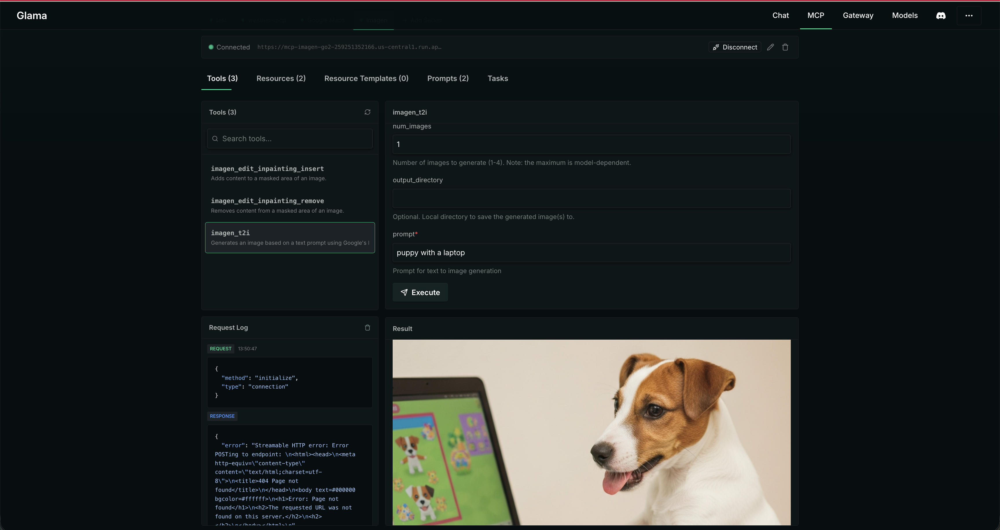

You'd also notice that Imagen supports the image created to be directly uploaded to a cloud storage bucket and that is exactly what we are going to use. 

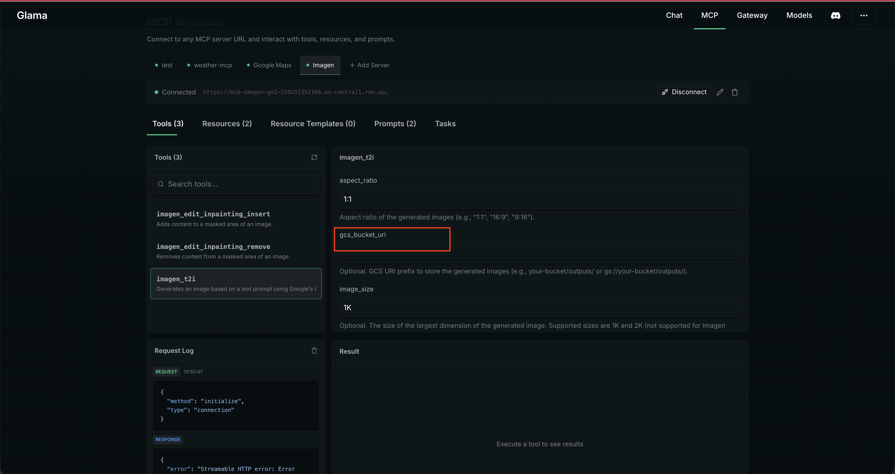

5. To be able to use Google Cloud Storage (or GCS) we need to do the following:

- Create a GCS that allows public access to viewing the objects
- Allow our cloud run service to be able to call Imagen Model
- Allow our cloud run service to be able to store images on Cloud Storage

📌 Run the following script in the cloud shell terminal to set it all up in one go. If you get prompted for conditions - just select None. That usually happens if you have already have some IAM roles may be with some conditions such as time limits - we want none at this stage.  

```
# 1. Get the current GCP project ID and Project Number
export PROJECT_ID=$(gcloud config get-value project)
export PROJECT_NUMBER=$(gcloud projects describe $PROJECT_ID --format="value(projectNumber)")
export BUCKET_NAME="${PROJECT_ID}-genmedia-mcp-bucket"

# 2. Construct the Default Compute Service Account email
export SERVICE_ACCOUNT="${PROJECT_NUMBER}-compute@developer.gserviceaccount.com"

# 3. Grant the "Vertex AI User" role to allow calling Imagen
gcloud projects add-iam-policy-binding $PROJECT_ID \
    --member="serviceAccount:$SERVICE_ACCOUNT" \
    --role="roles/aiplatform.user"

# 4. Create the GCS Bucket in us-central1 (if it doesn't already exist)
#    We use gsutil (or gcloud storage) to create the bucket.
if ! gcloud storage buckets describe gs://$BUCKET_NAME >/dev/null 2>&1; then
    echo "Creating bucket gs://$BUCKET_NAME..."
    gcloud storage buckets create gs://$BUCKET_NAME --project=$PROJECT_ID --location=us-central1
else
    echo "Bucket gs://$BUCKET_NAME already exists."
fi

# 5. Grant the "Storage Object Admin" role to allow saving images to GCS buckets
gcloud projects add-iam-policy-binding $PROJECT_ID \
    --member="serviceAccount:$SERVICE_ACCOUNT" \
    --role="roles/storage.objectAdmin"

# 6. Grant the storage bucket Object Viewer role to allow accessing created images
gcloud storage buckets add-iam-policy-binding gs://$BUCKET_NAME \
    --member=allUsers \
    --role=roles/storage.objectViewer


echo "Setup complete! Your storage bucket is: gs://$BUCKET_NAME"

```

Awesome, it is time to use our MCP server in ADK!

6. Add the deployed Imagen MCP server to ADK:

```
cloud_storage_url = "gs://your-project-genmedia-mcp-bucket" # add the gcs url returned from previous step
generate_weather_postcard = McpToolset(
    connection_params=StreamableHTTPConnectionParams(
        url="your-cloud-run-imagen-mcp-url/mcp",
        timeout=60,
        
    ), tool_filter=["imagen_t2i"]
)
```

7. Add it to our list of toolset that agent can use and update agent description and instructions:

```
root_agent = Agent(
    model='gemini-2.5-flash',
    name='root_agent',
    description='A helpful assistant for giving weather updates of a US location and creating weather postcards.',
    instruction=f"""
        You are helpful assistant that tells the weather of a US location using 'get_weather' tool.
        When the user provides a location, use 'get_coordinates' to get the latitude and longitude of the place.
        And pass the latitude and longitude with 2 decimal points to the 'get_weather' tool to provide weather details.
        When user asks to generate the postcard, use the 'generate_weather_postcard' tool.
        You will generate a postcard image of aspect_ratio of 16:9 for the weather summary in the place specified by the user.
        The image should be animated and colorful.
        Store the generated postcard image to google cloud storage: {cloud_storage_url}.
        Return the HTTPS URL to the user!
    """,
    tools=[get_coordinates, get_weather, generate_weather_postcard]
)
```

8. Let's run: 

```
uv run adk web
```

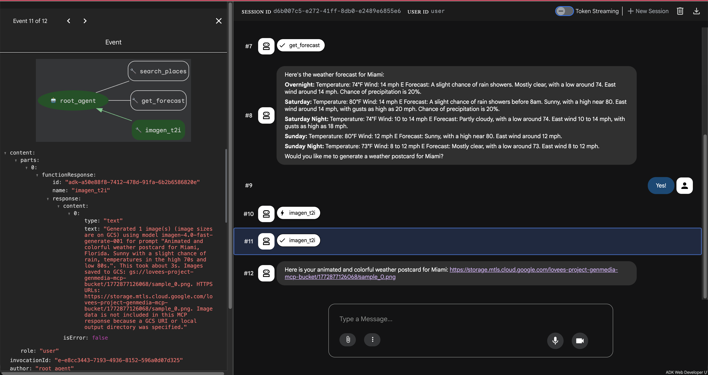

This is what you'd see on the GCS:


Hooray! 🥳 You have configured another MCP server! 

<!-- ------------------------ -->

## 🏁 Setup, deploy and use AgentMail MCP server
Duration: 15

It's time for our final MCP server with which we will be able to get these postcards delivered straight to our inboxes!📬

For this we will use a third party integration supported by ADK called [Agent Mail](https://google.github.io/adk-docs/integrations/agentmail/).

📌 You can checkout the tools exposed by this MCP server using the [MCP inspector](https://modelcontextprotocol.io/docs/tools/inspector) 🔍 if can run locally.

📌 Before you proceed further let's take a moment to understand the [deployment patterns](https://google.github.io/adk-docs/tools-custom/mcp-tools/#deployment-patterns) in agentic systems. 

For this one we will choose to run as **Self-Contained Stdio MCP Server** as opposed to our remote servers.

1. So, let's first setup Agent Mail for which you need to do the following: 

- Sign up to Agent Mail - yes I get it!🙄 But hey, you can use this for future agentic experiments!
- Create an inbox to use for sending emails
- Create an API key for MCP server calls

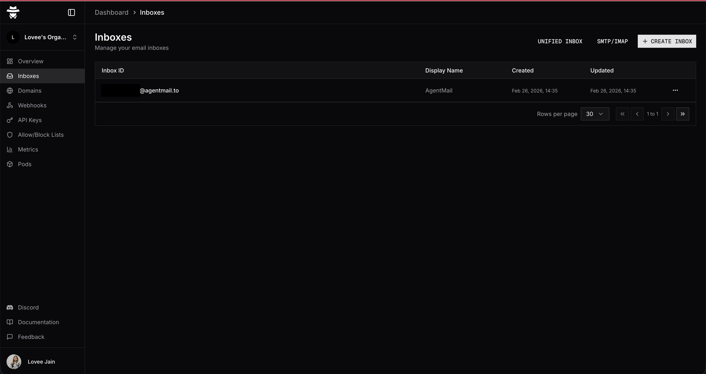

2. Add the AgentMail API key to your `.env` file:

```
AGENTMAIL_API_KEY=your-api-key
```

3. Update imports:
```
from google.adk.tools.mcp_tool.mcp_session_manager import StdioConnectionParams, StreamableHTTPConnectionParams
from mcp import StdioServerParameters
```

4. Let's configure the stdio MCP server in our ADK project:

```
agentmail_env = os.environ.copy()
agentmail_env["AGENTMAIL_API_KEY"] = os.environ.get("AGENTMAIL_API_KEY")
inbox_id="your-inbox-id"
send_email = McpToolset(
    connection_params=StdioConnectionParams(
        server_params=StdioServerParameters(
            command="npx",
            args=[
                "-y",
                "agentmail-mcp",
            ],
            env=agentmail_env
        ),
        timeout=10,
    ), tool_filter=["send_message"]
)
```

5. Finally, let's add it to the tools available for our agent and update it's instructions and description.

```
root_agent = Agent(
    model='gemini-2.5-flash',
    name='root_agent',
    description='A helpful assistant for giving weather updates of a US location, creating weather postcards and sending the weather summary and postcard on email.',
    instruction=f"""
        You are helpful assistant that tells the weather of a US location using 'get_weather' tool.
        When the user provides a location, use 'get_coordinates' to get the latitude and longitude of the place.
        And pass the latitude and longitude with 2 decimal points to the 'get_weather' tool to provide weather details.
        When user asks to generate the postcard, use the 'generate_weather_postcard' tool.
        You will generate a postcard image of aspect_ratio of 16:9 for the weather summary in the place specified by the user.
        The image should be animated and colorful.
        Store the generated postcard image to google cloud storage: {cloud_storage_url}.
        You can return the HTTPS URL to the user!
        When prompted to email the weather postcard, use 'send_email' tool to send the email.
        Create an nice HTML body that includes the weather summary in poetic form and the hyperlinked image URL to the postcard.
        Subject should always be 'Weather Summary'.
        Note: We are not sending any attachments.
        You can use {inbox_id} as the inbox_id for sending the email.
    """,
    tools=[get_coordinates, get_weather, generate_weather_postcard, send_email]
)
```

6. Let's run it!! 🏃‍♀️‍➡️🏃‍♀️‍➡️

```
uv run adk web
```

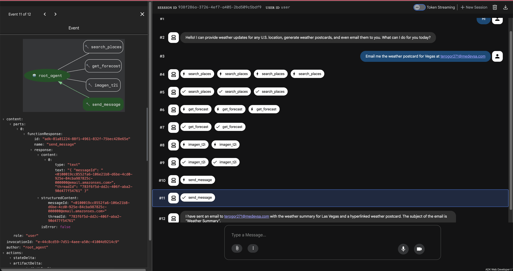

This is the email I got 🤩:

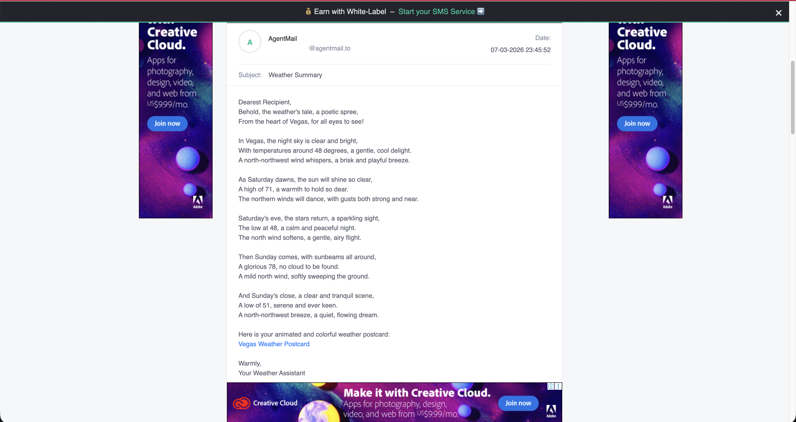

This is my weather postcard 💌:


I can see the glitter ✨ in your eyes 👀! 

<!-- ------------------------ -->

## Deploy your ADK agent on Cloud Run
Duration: 10

It is time we deploy our Agent with stdio AgentMail MCP server! But before we do that let's take a moment to revisit the final architecture of our application.

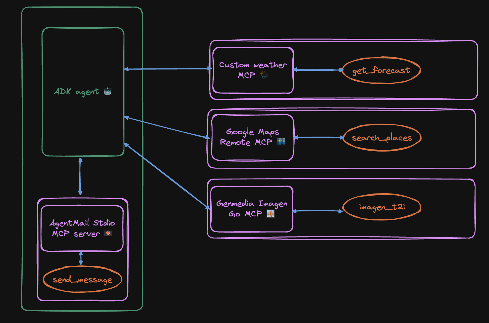

1. As per the documentation, you need to add a Dockerfile to the root of your project specifying the npm packages or Python modules needed for your MCP server and the agent can pick it up.

```
FROM python:3.11-slim
WORKDIR /app

# Create a non-root user (best practice, consistent with adk output)
RUN adduser --disabled-password --gecos "" myuser

# Install Node.js and npm for MCP servers (requires root)
RUN apt-get update && apt-get install -y nodejs npm && rm -rf /var/lib/apt/lists/*

# Switch to the non-root user
USER myuser
ENV PATH="/home/myuser/.local/bin:$PATH"

# Install ADK and any other dependencies
RUN pip install google-adk==1.26.0

# Copy agent directory (adjust permissions for the non-root user)
COPY --chown=myuser:myuser postcards /app/agents/postcards

EXPOSE 8080

# Start the ADK web server
CMD adk web --port=8080 --host=0.0.0.0 --session_service_uri=memory:// --artifact_service_uri=memory:// "/app/agents"
```

2. If you started using Vertex AI instead of relying on the API keys, then you need to get Application Default Credentials.

```
gcloud auth application-default login
```

3. Let's copy our environment variables to a yml file in `/postcards_from_cloud` that we can pass during deployment:

```
touch env.yaml
```

Open `env.yaml` and copy your environment variables from `.env` file. And update them to an acceptable yaml format:

```
GOOGLE_GENAI_USE_VERTEXAI:'1'
GOOGLE_GOOGLE_CLOUD_PROJECT:'your-project'
GOOGLE_CLOUD_LOCATION:'us-central1'
GOOGLE_API_KEY:'your-api-key'
GOOGLE_MAPS_API_KEY:'your-api-key'
AGENTMAIL_API_KEY:'your-api-key'
```

4. Deploy on Cloud Run - we will need to use standard Cloud Run deployment and not `adk deploy` as it doesn't work at this stage.

```
gcloud run deploy adk-postcards\
  --source . \
  --region us-central1 \
  --allow-unauthenticated \
  --port 8080 \
  --env-vars-file env.yaml
```

5. Tada! 🎉🎉🎉

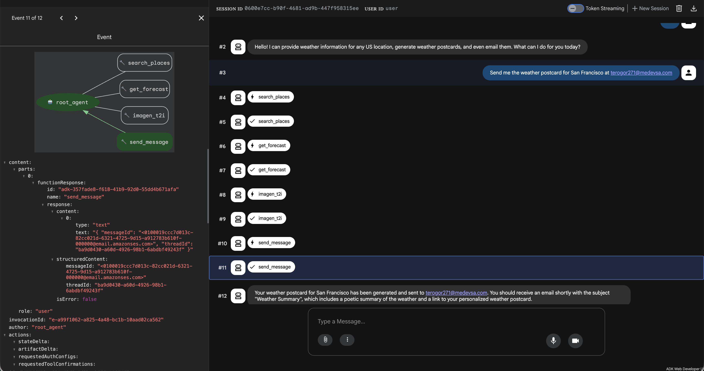

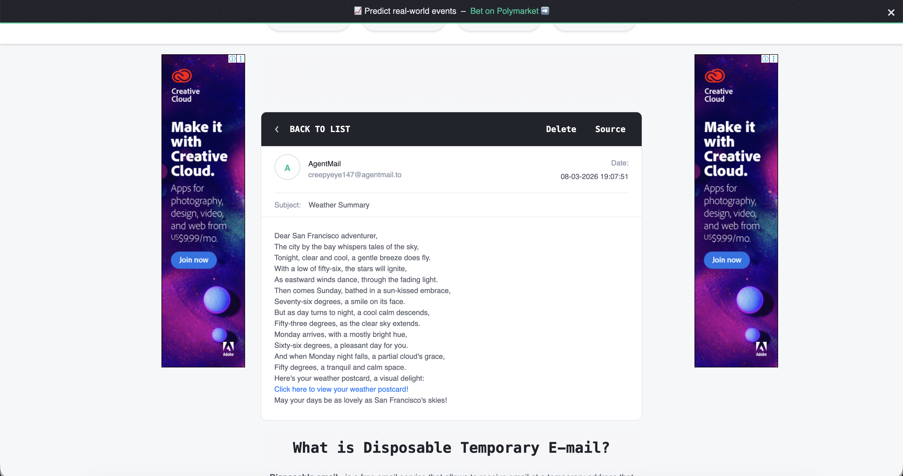


Yes, we did it!! 👩‍🍳😘

<!-- ------------------------ -->

## Next steps: Agent-as-a-service
Duration: 5

Congratulations on coming this far!! 😎🎉 You are a true warrior! But the story doesn't end here..

Did you know agents can be called as APIs?! Checkout [how to use API servers in ADK](https://google.github.io/adk-docs/runtime/api-server/) to expose your agents.

Enter ↵ **Agents-as-a-service**!! 

Let's give it a go:

```
curl --location 'your-cloud-run-url-for-adk/run' \
--header 'Authorization: Bearer $(gcloud auth print-access-token)' \
--header 'Content-Type: application/json' \
--data '{
    "app_name": "postcards",
    "user_id": "user",
    "session_id": "your-current-session-id",
    "new_message": {
        "role": "user",
        "parts": [
            {"text": "Can you give me the url to my weather postcard?"}
        ]
    },
    "streaming": false
}'
```

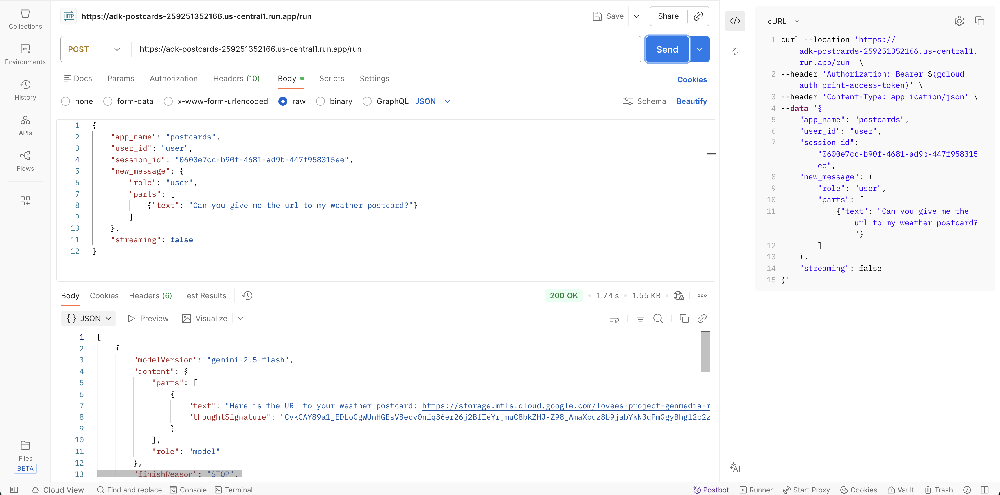

Again the postcard after opening the url returned in the response:


Feels magical ✨🪄, isn't it?! Well this is just a start - you can do so much, I'd be curios to know what you do next! 

Thanks! ♥️